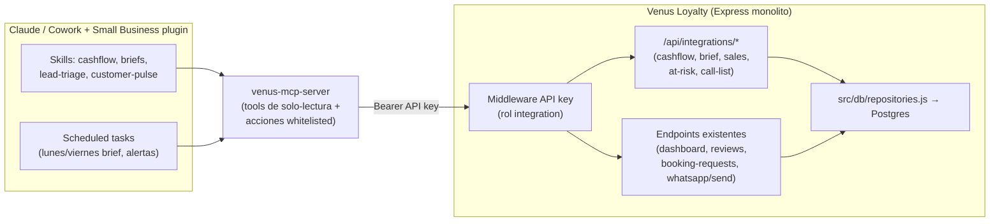

# Análisis de Integración: Venus Loyalty + Claude Small Business

> Reporte de arquitectura. Fecha: 2026-05-19. Codebase analizado: `venus-loyalty` (rama `main`).
> Negocio: **Venus Cosmetología** (clínica de estética/depilación/faciales) + **Venus The Coffee Bar** (POS). Un solo local, MXN, zona horaria America/Mexico_City, operación intensiva por WhatsApp.

---

## 1. Mapa Técnico de la Plataforma

### Stack
- **Lenguaje/Runtime:** Node.js, ES Modules (`"type":"module"` en `package.json`).
- **Framework HTTP:** Express 5 (`server.js`, 6624 líneas, monolito).
- **Base de datos:** PostgreSQL vía **Prisma ORM 5** (`prisma/schema.prisma`, 36 modelos). Persisten restos de **Firebase/Firestore** (`lib/firebase.js`, endpoints `*-firebase`) — migración a Postgres en curso (`docs/MIGRACION_POSTGRES.md`).
- **Hosting:** servidor Node largo-vivo (cron en proceso vía `node-cron`), no serverless. SQLite local `venus.db` solo legacy.
- **Otros:** `@anthropic-ai/sdk` (ya instalado), `passkit-generator` (Apple Wallet), `googleapis` (Google Wallet/Calendar), `nodemailer`+Resend, Cloudinary (fotos de expedientes), `xlsx`, `qrcode`.

### Arquitectura
Monolito Express. `server.js` concentra ~163 rutas; routers modulares montados:
- `appointmentsRouter` → `/api/*`
- `calendarRoutes` → `/api/admin/calendar/*`
- `whatsappWebhook` (Twilio, legacy Firestore) → `/api/whatsapp/*`
- `webhookEvolution` (Evolution API, Postgres) → `/api/webhook/evolution/*`
- `clientRecordsRouter` → `/api/client-records/*`
- `coffeePosRouter` → `/api/pos/*`
- `skinAnalysisRouter` → `/api/skin-analysis/*`

Acceso a datos centralizado en `src/db/repositories.js` (≈17 repos: `CardsRepo`, `AppointmentsRepo`, `SalesRepo`, `ExpensesRepo`, `ProductsRepo`, `GiftCardsRepo`, `EventsRepo`, `NotificationsRepo`, etc.). Cron en `src/scheduler/cron.js`.

### Modelos de datos principales (Prisma)
`Card` (cliente/lealtad), `Appointment` (citas), `Service`, `Product`, `Sale` (historial de ventas), `Expense` (gastos categorizados), `GiftCard` + `GiftCardRedeem`, `Event` (sellos/canjes), `Review`, `BookingRequest` (leads página pública), `WhatsappMessage`, `Notification`, `ClientRecord`+`TreatmentSession`+`ClientPhoto` (expedientes), `SkinAnalysis`+`Score`+`Image` (IA piel), POS coffee: `CoffeeSale`+`CoffeeSaleItem`+`CoffeeCashSession`+`CoffeeCashMovement`+`CoffeeProduct`, `Admin`, `BusinessConfig`, `BlockedSlot`, dispositivos wallet.

### API existente (REST, ~163 endpoints) — los más relevantes
| Método | Ruta | Qué hace |
|---|---|---|
| POST | `/api/admin/login` | Login admin → JWT en cookie `adm` |
| GET | `/api/admin/metrics` | Totales lealtad (cards, sellos, ciclos, sellos/canjes hoy) |
| GET | `/api/admin/metrics-month` | Métricas del mes (clientes activos, return rate) |
| GET | `/api/dashboard/today` | Citas e ingresos de hoy |
| GET | `/api/dashboard/history` | Citas e ingresos últimos 7 días |
| GET | `/api/admin/top-clients` | Top 10 clientes por sellos |
| GET | `/api/appointments/range?from&to` | Citas por rango |
| POST | `/api/appointments` | Crear cita (+Google Calendar +WhatsApp) |
| PATCH | `/api/appointments/:id/status` | Cambiar estado de cita |
| POST | `/api/appointments/:id/payment` | Registrar cobro de cita |
| GET | `/api/transactions` | Ventas/transacciones |
| GET/POST | `/api/expenses` | Gastos |
| GET | `/api/giftcards` | Gift cards |
| GET | `/api/admin/birthdays` | Cumpleaños próximos |
| GET | `/api/admin/reviews` | Reseñas (promedio, distribución) |
| GET | `/api/booking-requests` | Leads pendientes |
| POST | `/api/whatsapp/send` | Enviar WhatsApp |
| GET | `/api/pos/*` (router) | Ventas/cortes de caja del coffee bar |

**Autenticación:** `lib/auth.js` — `adminAuth` (JWT firmado con `ADMIN_JWT_SECRET` en cookie HttpOnly `adm`, expone `req.admin={uid,email,role}`), `requireRole("admin"|"recepcion")`. `basicAuth` (HTTP Basic `STAFF_USER:STAFF_PASS`) solo en `/api/stamp/:cardId`, `/api/redeem/:cardId`, `/api/export.csv`, `/staff.html`. Apple PKI en `/v1/*`. Endpoints `/api/public/*` sin auth.

### Webhooks
- **Entrantes:** `POST /api/whatsapp/*` (Twilio), `POST /api/webhook/evolution/*` (Evolution API: `messages.upsert`, `poll.response`, `connection.update`), `POST /v1/log` (Apple).
- **Salientes:** **No emite webhooks de negocio.** Solo llamadas push hacia terceros (WhatsApp, Google Calendar, APNs, FCM, Resend). Un consumidor externo (Claude) **no puede suscribirse a eventos** hoy.

### Integraciones externas actuales
Google Wallet + Apple Wallet (passes lealtad), Google Calendar (Service Account + OAuth2), Twilio y Evolution API (WhatsApp), Resend/SMTP (email), Firebase FCM/Firestore (legacy + push), Cloudinary (fotos), Yiyuan Skin Analyzer (`src/services/yiyuan.js`), **Claude Haiku 4.5 ya integrado** para narrativa de piel (`src/services/ai/claudeNarrative.js`, con prompt caching). **No hay** QuickBooks, Stripe, PayPal, Square, HubSpot, DocuSign — ninguno de los conectores nativos del plugin.

---

## 2. Inventario de Datos Valiosos

| Dato | Tabla/colección | Volumen / actualización | Fuente de verdad |
|---|---|---|---|
| Citas | `appointments` | Decenas–cientos/mes; cambia todo el día | **Sí** (replica a Google Calendar) |
| Ventas de servicio/producto | `sales` + `appointments.totalPaid/productsSold` | 1 por cita cobrada + ventas directas | **Sí** |
| Ventas coffee bar | `coffee_sales`+`coffee_sale_items` | Alto volumen diario (POS) | **Sí** |
| Cortes de caja coffee | `coffee_cash_sessions`+`coffee_cash_movements` | 1–2/día | **Sí** |
| Gastos | `expenses` (categorías: productos, renta, salarios, marketing…) | Pocos/semana, manual | **Sí** |
| Clientes / lealtad | `cards` (phone único, `lastVisit`, `stamps`, `birthday`) | Cientos–miles; crece lento | **Sí** |
| Productos / inventario | `products` (price, **cost**, stock, minStock) | Decenas; stock cambia con ventas | **Sí** |
| Servicios y precios | `services` (price; **sin cost**) | Decenas; cambia raro | **Sí** |
| Gift cards | `giftcards`+`gift_card_redeems` | Pocas/mes | **Sí** |
| Reseñas post-cita | `reviews` (stars 1–5, liked, improve, reply) | 1 por cita completada | **Sí** |
| Leads (reservas web) | `booking_requests` (status pending/approved) | Variable; entran por la web | **Sí** |
| Conversaciones WhatsApp | `whatsapp_messages` (in/out) | Alto volumen diario | **Sí** |
| Análisis de piel IA | `skin_analyses`+scores+images | Pocos/semana | Réplica enriquecida de Yiyuan |
| Expedientes clínicos | `client_records`+`treatment_sessions`+`client_photos` | Crece por sesión | **Sí** |

---

## 3. Inventario de Acciones Automatizables

| Acción | Endpoint/función | Frecuencia | Idempotente / Reversible / Destructiva |
|---|---|---|---|
| Crear cita | `POST /api/appointments` (`server.js:1348`) | Alta | No idempotente · reversible (cancel) · no destructiva |
| Cambiar estado de cita | `PATCH /api/appointments/:id/status` (`:1749`) | Alta | Idempotente por valor · reversible · no destructiva |
| Cancelar cita | `PATCH /api/appointments/:id/cancel` (`:1849`) | Media | Idempotente · semi-reversible · no destructiva |
| Registrar cobro de cita | `POST /api/appointments/:id/payment` (`:1121`) | Alta | **No** idempotente · reversible manual · sensible (dinero) |
| Registrar venta directa | `POST /api/direct-sales` (`:1208`) | Media | No idempotente · sensible (dinero) |
| Crear gasto | `POST /api/expenses` (`:2702`) | Baja | No idempotente · reversible (DELETE) |
| Enviar WhatsApp | `POST /api/whatsapp/send` (`:702`) | Alta | **No** idempotente · **no** reversible · sensible (cliente) |
| Push masivo a wallets | `POST /api/admin/push-all` (`:5271`) | Baja | No idempotente · no reversible · **sensible** |
| Crear notificación interna | `POST /api/notifications` (`:4607`) | Media | No idempotente · reversible |
| Marcar lead contactado/agendado | `POST /api/booking-requests/:id/contacted\|booked` (`:4059/4072`) | Media | Idempotente · reversible |
| Responder reseña | `PATCH /api/admin/reviews/:id/reply` (`:6565`) | Baja | Idempotente por valor · reversible |
| Agregar sello / canjear | `POST /api/admin/stamp` · `/api/admin/redeem` | Alta | Throttle 1/día (`canStamp`) · reversible manual · sensible |
| Crear/editar servicio o producto | `POST /api/services` · `/api/products` | Baja | No idempotente · reversible |

> **Recomendación de alcance:** la integración inicial con Claude debe ser **lectura + acciones de bajo riesgo** (notificaciones internas, borradores). Acciones que tocan dinero o mandan WhatsApp al cliente deben requerir confirmación humana, no ejecución autónoma.

---

## 4. Matriz de Oportunidades por Habilidad

| Habilidad | Fit | Datos necesarios | Endpoints a exponer | Valor |
|---|---|---|---|---|
| **cash-flow-snapshot** | **Alto** | `sales` + `appointments.totalPaid` + `coffee_sales` + `expenses` + `coffee_cash_sessions` | **Nuevo** `GET /api/integrations/finance/cashflow?from&to` (unifica las 3 fuentes de ingreso + gastos) | Visión real de caja sin contador; hoy está fragmentada en 3 tablas |
| **monday-brief / friday-brief** | **Alto** | `dashboard/history`, `appointments/range`, `reviews`, `birthdays`, productos low-stock | Reusar `GET /api/dashboard/history`, `/api/admin/birthdays`; **nuevo** `GET /api/integrations/brief` | Reporte semanal automático que hoy nadie arma |
| **business-pulse** | **Alto** | `metrics`, `metrics-month`, `dashboard/today`, `reviews` | Reusar `/api/admin/metrics-month`, `/api/dashboard/today` | KPI snapshot inmediato para el dueño |
| **sales-brief** | **Alto** | `sales`, `appointments` por servicio, `coffee_sales` por producto | Reusar `GET /api/transactions`; **nuevo** `GET /api/integrations/sales/breakdown?from&to&by=service\|product` | Saber qué servicio/producto vende y cuál no |
| **customer-pulse / customer-pulse-check** | **Alto** | `reviews` (stars/liked/improve), `cards.lastVisit`, `whatsapp_messages` | Reusar `GET /api/admin/reviews`; **nuevo** `GET /api/integrations/customers/at-risk` (clientes sin visita N días) | Detecta insatisfacción y clientes que se enfrían |
| **handle-complaint** | **Alto** | `reviews` con `stars<=3`, `whatsapp_messages` recientes | Reusar `GET /api/admin/reviews?minStars`/`PATCH /api/admin/reviews/:id/reply` | Ya existe el canal de respuesta; Claude redacta borrador |
| **lead-triage** | **Alto** | `booking_requests` (pending), `whatsapp_messages` entrantes | Reusar `GET /api/booking-requests`, acciones `contacted/booked` | Leads de la web que se pierden sin seguimiento |
| **call-list** | **Alto** | `cards` con `lastVisit` viejo, no-shows (`appointments.status=cancelled`), `booking_requests` | **Nuevo** `GET /api/integrations/customers/call-list` | Lista priorizada de a quién llamar/escribir |
| **run-campaign** | **Alto** (sensible) | Segmentos: cumpleaños, lapsed, tarjetas completas | Reusar `GET /api/admin/birthdays`; **nuevo** segmentación + `POST /api/whatsapp/send` con aprobación | Reactivación de clientes; **requiere gate humano** |
| **margin-analyzer** | **Medio** | `products.price/cost` (ok), `services.price` (sin `cost`), coffee `price/tax` | **Nuevo** `GET /api/integrations/margins` | Margen de **producto** y coffee sí; **servicio NO** (falta campo `cost`) |
| **month-end-prep / close-month** | **Medio** | `sales`+`expenses`+`coffee_sales` agregados mensuales | Mismo endpoint cashflow con `granularity=month` | Sustituto de QuickBooks (que no existe aquí) |
| **month-heads-up** | **Medio** | `appointments` futuras del mes + ingreso esperado | Reusar `GET /api/appointments/range` | Proyección de ingresos del mes |
| **tax-prep** | **Medio** | Ventas (coffee tiene `tax_rate 0.16`), `expenses` | Endpoint cashflow con desglose IVA | Apoyo declaración SAT; servicios no llevan IVA explícito |
| **crm-cleanup / crm-maintenance** | **Medio** | `cards` con email/birthday nulos, formato de teléfono | **Nuevo** `GET /api/integrations/crm/quality` | Higiene de datos; phone ya es único |
| **content-strategy** | **Medio** | `reviews` positivas, `services`, análisis de piel | Reusar `/api/public/services`, `/api/admin/reviews` | Insumos para contenido/marketing |
| **canva-creator** | **Medio** | Servicios, precios, promos (`Setting` promo-2025) | Reusar `/api/public/services` (Canva es conector nativo del plugin) | Material gráfico de promos |
| **price-check** | **Bajo** | `services`/`products` precios | Reusar `/api/services`, `/api/products` | Sólo expone catálogo; comparación es externa |
| **ticket-deflector** | **Bajo** | `whatsapp_messages` entrantes, FAQ/`BusinessConfig` | Reusar webhook Evolution + `/api/whatsapp/send` | Borradores de respuesta a FAQs por WhatsApp |
| **quarterly-review** | **Bajo** | Agregados trimestrales | Endpoint cashflow `granularity=quarter` | Útil pero baja frecuencia |
| **invoice-chase** | **N/A** | — | — | No hay cuentas por cobrar / facturas a crédito; se cobra al momento (`totalPaid`) |
| **plan-payroll** | **N/A** | — | — | No hay modelo de empleados/horas; staff es solo `staffName` string |
| **contract-review** | **N/A** | — | — | No hay contratos/DocuSign en el dominio |
| **job-post-builder** | **N/A** | — | — | Sin datos de RR.HH.; no requiere integración |

---

## 5. Top 5 Quick Wins (orden de implementación recomendado)

### 1. Cash-Flow Snapshot unificado
- **Qué hace:** una sola vista de dinero que entra (citas cobradas + ventas directas + coffee bar) vs. gastos, por rango/mes.
- **Habilidad:** `cash-flow-snapshot` (+ alimenta `month-end-prep`, `business-pulse`).
- **Nuevo:** `GET /api/integrations/finance/cashflow?from=YYYY-MM-DD&to=YYYY-MM-DD&granularity=day|month` → `{income:{services,products,coffee,giftcards}, expensesByCategory, net, byPeriod[]}`.
- **Reutiliza:** `SalesRepo.findByDateRange`, `ExpensesRepo.findByDateRange`, `AppointmentsRepo.findByDateRange`, router `coffee-pos`.
- **Esfuerzo:** 8–12 h-dev.
- **Valor:** elimina consolidación manual de 3 tablas; el dato hoy no existe junto.
- **Métrica de éxito:** dueño consulta caja en <30 s sin abrir Postgres; cuadre vs. corte de caja coffee con <2% de discrepancia.

### 2. Monday/Friday Brief automático
- **Qué hace:** resumen semanal: citas próximas, ingresos vs. semana previa, reseñas nuevas, cumpleaños, productos por agotarse.
- **Habilidad:** `monday-brief` / `friday-brief`.
- **Nuevo:** `GET /api/integrations/brief?type=monday|friday` (compone datos existentes).
- **Reutiliza:** `/api/dashboard/history`, `/api/admin/metrics-month`, `/api/admin/birthdays`, `/api/admin/reviews`, `ProductsRepo.findLowStock`.
- **Esfuerzo:** 6–8 h-dev.
- **Valor:** reporte ejecutivo que hoy nadie produce.
- **Métrica:** brief entregado por WhatsApp/Slack cada lunes/viernes sin intervención; apertura/lectura por el dueño.

### 3. Lead-Triage de reservas web
- **Qué hace:** prioriza `booking_requests` pendientes + entrantes de WhatsApp y propone siguiente acción.
- **Habilidad:** `lead-triage` (+ `call-list`).
- **Nuevo:** ninguno crítico; opcional `GET /api/integrations/customers/call-list`.
- **Reutiliza:** `GET /api/booking-requests`, `POST /api/booking-requests/:id/contacted|booked`, `WhatsappMessage`.
- **Esfuerzo:** 4–6 h-dev (solo auth M2M + lectura).
- **Valor:** leads que hoy se pierden por falta de seguimiento → citas.
- **Métrica:** % de `booking_requests` pasados a `booked` dentro de 24 h sube.

### 4. Customer-Pulse + Handle-Complaint
- **Qué hace:** detecta reseñas ≤3★ y clientes que dejaron de venir; redacta borrador de respuesta/recuperación.
- **Habilidad:** `customer-pulse-check`, `handle-complaint`.
- **Nuevo:** `GET /api/integrations/customers/at-risk?days=60`.
- **Reutiliza:** `GET /api/admin/reviews`, `PATCH /api/admin/reviews/:id/reply`, `CardsRepo` (`lastVisit`).
- **Esfuerzo:** 6–8 h-dev.
- **Valor:** retención; respuesta rápida a quejas antes de que escalen a redes.
- **Métrica:** tiempo medio de respuesta a reseña negativa < 24 h; reactivación de clientes lapsed.

### 5. Sales-Brief por servicio/producto
- **Qué hace:** desglose de ventas por servicio, producto e ítem del coffee bar; tendencias.
- **Habilidad:** `sales-brief` (+ `margin-analyzer` para productos).
- **Nuevo:** `GET /api/integrations/sales/breakdown?from&to&by=service|product`.
- **Reutiliza:** `GET /api/transactions`, `Sale.productsSold`, `coffee_sale_items`.
- **Esfuerzo:** 6–10 h-dev.
- **Valor:** decisiones de precio/portafolio basadas en datos.
- **Métrica:** se identifican top/bottom 5 servicios mensualmente; acción de pricing tomada.

> **Total Top 5 ≈ 30–44 h-dev** sobre la base de auth M2M (Gap #1, ver §6).

---

## 6. Gaps Críticos en la Plataforma (orden de prioridad)

1. **No hay auth machine-to-machine (BLOQUEANTE).** Solo JWT en cookie de login admin y Basic Auth `STAFF_USER:STAFF_PASS` limitado a 4 rutas. Claude/MCP no tiene forma limpia de autenticarse a `/api/admin/*`. **A construir:** middleware de API key (`Authorization: Bearer <token>`) con rol propio `integration` (solo lectura + acciones whitelisted), validado contra `Setting` o env var. ~4–6 h.
2. **No hay endpoints de lectura agregada cross-dominio.** Ingresos están partidos en `sales`, `appointments.totalPaid`, `coffee_sales`; no existe cash-flow unificado ni desglose por servicio. **A construir:** namespace `/api/integrations/*` (cashflow, brief, sales/breakdown, customers/at-risk, call-list).
3. **No hay webhooks salientes de negocio.** Claude no puede reaccionar a eventos (cita creada, reseña ≤3★, lead nuevo). Mitigación inicial: **scheduled tasks de Claude que hacen polling** a los endpoints de lectura. Mejora futura: emitir webhook saliente desde `AppointmentsRepo`/`Review` create.
4. **`Service` no tiene campo `cost`.** Bloquea `margin-analyzer` para servicios (el 80% del negocio de estética). Producto y coffee sí tienen costo. **A construir:** columna `cost Decimal?` en `Service` + captura en UI (opcional para arrancar).
5. **Sin logging estructurado ni observabilidad.** Todo es `console.log("[MODULO] …")`. Para depurar la integración conviene log JSON con request id en el namespace `/api/integrations/*`. ~3 h.
6. **Sin idempotencia ni rate limiting global.** Solo `canStamp()` (1 sello/día). Si Claude reintenta `POST /api/appointments` o `payment` puede duplicar. **A construir:** soporte de header `Idempotency-Key` al menos en endpoints de escritura que Claude use; rate limit básico en `/api/integrations/*`.
7. **Doble fuente legacy Firestore/Postgres.** Endpoints `*-firebase` conviven con Prisma. La integración debe consumir **solo** los repos Prisma (`src/db/repositories.js`) para evitar datos inconsistentes.

> El esquema **sí permite** extraer las métricas de negocio clave (ingresos, gastos, retención, reseñas, leads). El gap real no es de datos sino de **superficie de acceso** (auth M2M + endpoints agregados).

---

## 7. Arquitectura de Integración Recomendada

**Recomendación: Opción D (Híbrido) con eje en A — MCP server propio + pocos endpoints REST agregados + scheduled tasks.**

Justificación:
- La plataforma **no** está en los conectores nativos del plugin, así que las habilidades no la leerán solas → se necesita un **MCP server propio** (Opción A) que Claude/Cowork invoque como herramientas.
- No conviene reescribir lógica: el MCP server es **delgado**, solo traduce tools ↔ REST existente + 5 endpoints nuevos `/api/integrations/*` (Opción B parcial).
- No hay webhooks salientes → para briefs/alertas se usan **scheduled tasks** de Claude que hacen polling (Opción C) en vez de construir infra de eventos ahora.
- Mantenimiento acotado: 1 servicio MCP + 5 endpoints + 1 middleware de API key.

Acciones sensibles (WhatsApp masivo, cobros, push-all) **no** se exponen como tools autónomas: el MCP devuelve borradores y la ejecución queda detrás de aprobación humana en el panel admin existente.

---

## 8. Plan de Implementación (4 semanas)

### Semana 1 — Fundaciones de acceso (desbloquea todo)
- Crear middleware **API key M2M** en `lib/auth.js` (`integrationAuth`): `Authorization: Bearer`, secreto en env `INTEGRATION_API_KEY`, rol `integration`.
- Definir namespace `/api/integrations/*` protegido por `integrationAuth` + rate limit básico + log JSON con request id.
- Entregable: `GET /api/integrations/ping` autenticado funcionando.
- Éxito: llamada autenticada desde fuera sin cookie de admin.

### Semana 2 — Endpoints agregados de lectura
- `GET /api/integrations/finance/cashflow` (une `SalesRepo`, `ExpensesRepo`, `AppointmentsRepo.totalPaid`, coffee POS).
- `GET /api/integrations/brief?type=monday|friday`.
- `GET /api/integrations/sales/breakdown` y `GET /api/integrations/customers/at-risk|call-list`.
- Éxito: cifras de cashflow cuadran contra `coffee_cash_sessions` y un mes real (<2% diff).

### Semana 3 — MCP server
- Construir `venus-mcp-server` (Node, `@modelcontextprotocol/sdk`) con tools de lectura mapeando los endpoints de S2 + `get_reviews`, `get_booking_requests`.
- 1 acción whitelisted de bajo riesgo: `create_internal_notification` (`POST /api/notifications`).
- Conectar al plugin Small Business; **probar primero `business-pulse` + `cash-flow-snapshot`** (solo lectura, máximo ROI, cero riesgo).
- Éxito: Claude responde "¿cómo va la caja este mes?" con datos reales vía MCP.

### Semana 4 — Scheduled tasks + habilidades de cliente
- Scheduled task: `monday-brief` y `friday-brief` automáticos (entrega a WhatsApp/Slack del dueño).
- Activar `lead-triage` (lectura `booking_requests`) y `customer-pulse-check`/`handle-complaint` (borradores de respuesta, sin envío autónomo).
- Opcional si hay tiempo: añadir columna `Service.cost` para habilitar `margin-analyzer`.
- Éxito global: el dueño recibe el brief semanal sin pedirlo; ≥1 lead/semana convertido vía triage; respuesta a reseñas negativas <24 h.

**Auth a implementar:** API key Bearer (`integrationAuth`, rol `integration`) — única pieza de seguridad nueva necesaria.
**Primera habilidad a probar:** `cash-flow-snapshot` + `business-pulse` (solo lectura, ROI inmediato, sin riesgo de escritura).
**Cómo medir el éxito:** (1) tiempo del dueño para obtener KPIs cae de minutos/manual a segundos; (2) brief semanal entregado 100% automático; (3) conversión de leads y velocidad de respuesta a quejas medibles en `booking_requests`/`reviews`.
